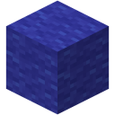

  

<h1 align="center">Create: To The Skies</h1>

  A skyblock modpack for Minecraft Java Edition 1.21.1 
  Automate everything, build flying machines, and turn your island into an industrial empire.

---

## ✨ What’s inside
- **Create** – rotational power, mechanical contraptions, and opportunity for amazing automation.
- **Mekanism** – high‑tech machinery, ore processing, and nuclear reactors.
- **Create Aeronautics** – airships, planes, and custom physics contraptions.
- **Skyblock Builder** – the core mod to make this a skyblock pack.
- **Aether I** - explore a dimension in the sky.
- **Bumblezone** - collect bee materials for buffs throughout your gameplay!
- **Just Dire Things** - The true endgame of the modpack. Use various machines to make Time Crystals.
- **Tons of quality‑of‑life mods** – better building, enhanced immersion, social mods, and more.

---

## 🖥️ System requirements
- **Minecraft**: 1.21.1
- **Mod loader**: NeoForge 21.1.226 (automatically installed by modern launchers)
- **Java**: Java 21 (the launcher should handle this, but verify if you run into issues)
- **RAM**: At least 4 GB allocated (6–8 GB recommended for a smooth experience)
- **GPU**: Any mid‑range card with OpenGL 4.5+ (shaders are optional)

---

## 🚀 Installation

> ⚠️ These instructions assume you are using **Prism Launcher**, **CurseForge App**, or **Modrinth App**.  
> If you use another launcher (MultiMC, ATLauncher, etc.) and know how to manually add mods/configs, simply download the latest release ZIP and copy its contents into a NeoForge 1.21.1 instance.

### 1. Download the pack
Go to the [Releases page](https://github.com/tokiponaenjoyer/Create-To-The-Skies/releases) and download the `alphaX-LAUNCHER` file for the latest version and for your mod launcher. If you have experience with modpacks then you can download the `Source code.zip` or `Source code.tar.gz` files from the latest release as well.  
*(Do not download the repository as a ZIP using the green “Code” button if you don't want to install the latest build as it might be unstable – use the Releases page instead.)*

### 2. Import into your launcher

#### 🟣 Prism Launcher
1. Open Prism Launcher.
2. Click **Add Instance** → **Import from ZIP**.
3. Select the ZIP file you downloaded.
4. The instance will be created with all mods, configs, and the correct NeoForge version.
5. Click **Launch**.

#### 🟠 CurseForge App
1. Open the CurseForge app and go to the **Minecraft** section.
2. Click **Create Custom Profile**.
3. Give it a name, choose **Minecraft 1.21.1**, and select **NeoForge** as the mod loader (latest version preferably).
4. Click **Create**.  
5. Right‑click the new profile → **Open Folder**.
6. Extract the downloaded ZIP file directly into that folder, overwriting existing files.
7. Go back to the CurseForge app, click the profile, and launch the game.

> 💡 *Alternatively, some CurseForge versions support **Import → Import a Modpack** – choose the ZIP file directly.*

#### 🟢 Modrinth App
1. Open the Modrinth app and go to the **Library** tab.
2. Click **Create Instance** → **Import from ZIP**.
3. Select the ZIP file you downloaded.
4. The instance will be automatically configured.
5. Click **Launch**.

---

## 🎮 How to play

1. **Create a new world** – the pack uses Skyblock Builder, so you’ll start on a tiny sky island.  
2. **Follow your own path (for now)** – Progression is still being planned. There is **no quest book or guided progression** at the moment. Explore the mods, experiment with automation, and build at your own pace.  
3. **Automate!** – the real fun begins when you set up your first press and rotational power and begin automating resource generation.

---

## 🛠️ Troubleshooting & tips
- **Missing mods?**  
  The pack is designed to be self‑contained; don’t add extra mods unless you know they’re compatible.  
- **Low FPS or game crash?**  
  Lower render distance, disable shaders (if enabled), or allocate more RAM.  
- **Multiplayer?**  
  This pack is single‑player focused, but you can copy the `mods/` and `config/` folders to a server running NeoForge 1.21.1 to play with friends.
**If the problem persists, please report it on [Issues](https://github.com/tokiponaenjoyer/Create-To-The-Skies/issues) and attach both your `crash-report` (if one exists) and `latest.log` file.**
---

## 📜 License
The original configuration files, scripts, and pack‑specific assets in this repository are dedicated to the public domain under the **Creative Commons Zero (CC0)** license.  
The bundled mods remain under their **own individual licenses** – see each mod’s page for details.

---

## 🤝 Contributing & feedback
Found a bug or have a suggestion?  
- Open an [issue](https://github.com/tokiponaenjoyer/Create-To-The-Skies/issues) on GitHub.
- Make a suggestion on the [Discord](discord.gg/xyJEj6gUbP).
- Pull requests are welcome for config tweaks, quests, and documentation.

---

  Have fun, and don’t fall off the island!

